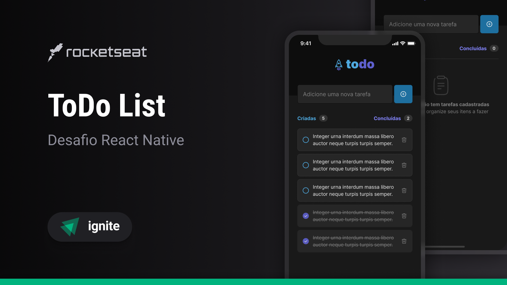

<h1 align="center">ToDo List</h1>

    Praticando os conceitos do React Native 

    <a href="#-tecnologias">Tecnologias</a>&nbsp;&nbsp;&nbsp;|&nbsp;&nbsp;&nbsp;
    <a href="#-projeto">Projeto</a>&nbsp;&nbsp;&nbsp;|&nbsp;&nbsp;&nbsp;
    <a href="#-layout">Layout</a>

 

    

## 🚀 Tecnologias

Esse projeto foi desenvolvido com as seguintes tecnologias:

- React Native
- TypeScript
- Expo
- React

## 💻 Projeto

Foi desenvolvido nesse projeto uma aplicação de controle de tarefas no estilo **to-do list**, que contém as seguintes funcionalidades:

- Adicionar uma nova tarefa
- Marcar e desmarcar uma tarefa como concluída
- Remover uma tarefa da listagem
- Mostrar o progresso de conclusão das tarefas

Apesar de serem poucas funcionalidades, foi utilizado conceitos como:

- Estados
- Imutabilidade do estado
- Listas e chaves no React Native
- Propriedades
- Componentização

## 📋 Layout 

Voce pode visualizar o layout do projeto através [DESSE LINK](https://www.figma.com/file/UQaT5dJ1h1RrplebWKiLVW/ToDo-List). É necessário ter uma conta no [Figma](https://figma.com) para acessa-lo.

---

Feito com 💜 by Phelipe Pereira :wave:
